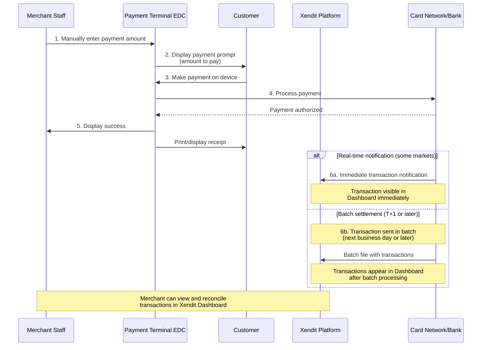

## Overview

For merchants who don't need POS integration, Xendit terminals can accept payments directly — just enter the amount on the device. This is ideal for simple retail setups, pop-up shops, or businesses that don't require automated transaction workflows.

No API or SDK integration is needed. Transactions are recorded and can be viewed in your **Xendit Dashboard** for reconciliation.

## How It Works

<Info>
**Transaction visibility varies by market**: Some markets support real-time transaction notifications to Xendit, making transactions visible in your Dashboard immediately. Other markets use batch settlement files sent T+1 or later, meaning transactions appear in your Dashboard after the batch is processed. Contact your Xendit representative to understand the notification timing for your specific market.
</Info>

## When to Use Device-Only Mode

- You don't have a POS system or custom software to integrate
- You want to start accepting payments immediately without development work
- Your staff manually enters transaction amounts at the point of sale

## Settlement

Funds are settled into your **Xendit Balance** within **T+1 day** after the transaction settlement is completed on the device. You can view all transactions in the **Xendit Dashboard**.
