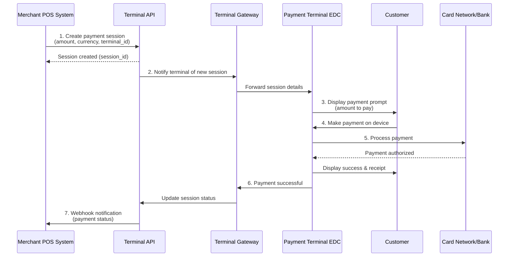
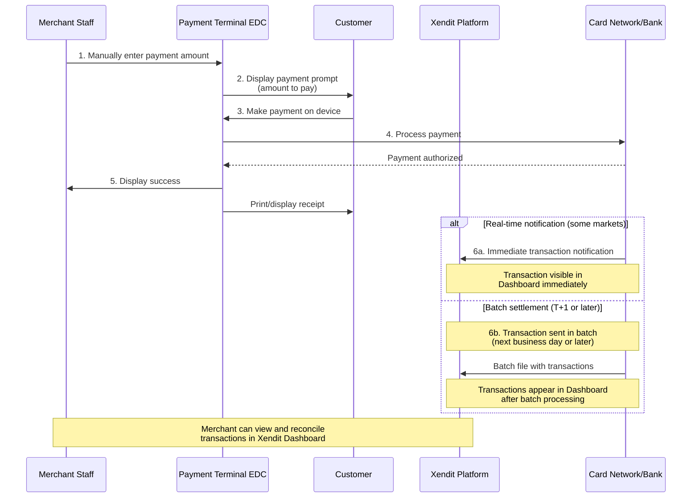

## Overview

<Frame>

</Frame>

Xendit Payment Terminal enables businesses to accept **in-person payments** through our Android-based payment terminals. Whether you're running a café, retail store, restaurant, or kiosk, our terminals let you seamlessly collect payments from **cards, QR, and e-money wallets** — all through one unified platform.

With a **single API integration**, you can connect your existing **Point of Sale (POS), ticketing, or kiosk software** to Xendit's terminals across **multiple countries**, including **Indonesia, Thailand, Vietnam, and Malaysia** (coming soon to the **Philippines**).

Our partnership with local financial institutions ensures smooth onboarding, compliance, and support in each market.

## Key Benefits

### 🌍 Multi-Country Reach with a Single Integration

Integrate once with the Xendit Terminal API and deploy in-person payments across Southeast Asia. The same API works in Indonesia, Thailand, Vietnam, and Malaysia — with upcoming support for the Philippines.

### 💳 Universal Payment Acceptance

Accept payments from **Visa, Mastercard, JCB, UnionPay, American Express**, **local debit cards**, and **QR payments**.

### ⚡ Fast Deployment and Go-Live

Our streamlined onboarding and close bank partnerships allow you to receive devices in multiple countries and go live in weeks, not months.

### 🧩 Flexible Integration Options

Connect your POS or software directly to the terminal through our API for self-serve kiosks, automated amount entry, transaction confirmation, and reconciliation.

### 🧑‍💼 Consultative Support

Our global operations and customer success teams collaborate closely with your Finance and Operations departments to optimize workflows, provide training, and ensure smooth payment acceptance.

## Country Availability & Supported Payment Methods

|  | Country | Payment Methods | Payment Channels |
| :----: | :---- | :---- | :---- |
| 🇮🇩 | Indonesia | Credit Cards | Visa, MasterCard, JCB |
|  |  | Debit Cards | GPN |
|  |  | QR Payments | QRIS |
|  |  | E-Money | Brizzi |
| 🇹🇭 | Thailand | Credit Cards | Visa, MasterCard, JCB, UnionPay, American Express (AMEX)  |
|  |  | Debit Cards | Visa, MasterCard |
|  |  | QR Payments | Thai QR PromptPay, TrueMoney Wallet, LINE Pay, ShopeePay, Alipay, Alipay+, WeChat Pay, MaxMe Wallet |
|  |  | Installments | Bangkok Bank, Krungsri (Bank of Ayudhya), SCB (Siam Commercial Bank), Kasikornbank (KBank), Krungthai Bank (KTB), TTB (TMBThanachart Bank), Shopee SPaylater Coming soon: UOB |
| 🇻🇳 | Vietnam | Credit Cards | Visa, MasterCard, American Express (AMEX), JCB, UnionPay |
|  |  | Debit Cards | NAPAS |
|  |  | QR Payments | Viet QR |
| 🇲🇾 | Malaysia | Credit Cards | Visa, MasterCard |
|  |  | Debit Cards | MyDebit, Visa, MasterCard |
|  |  | QR Payments | DuitNow QR (Coming Soon) |
| 🇵🇭 | Philippines | Coming Soon | Coming Soon |

## How It Works

Xendit Terminals can be used **with or without API integration**.

### POS-Integrated Payment Terminal

In this setup, your POS system communicates directly with Xendit Payment Terminal via our API. This enables automated payment workflows where transaction amounts are sent directly from your system to the terminal.

<Steps>
<Step title="Create payment session">
Your POS system creates a payment session through Terminal API with the transaction amount and terminal details.
</Step>

<Step title="Customer completes payment">
The terminal prompts the customer to tap, insert, or swipe their payment card or scan QR code.
</Step>

<Step title="Receive real-time updates">
Your system receives payment status updates through webhooks.
</Step>

<Step title="Complete transaction">
Payment is confirmed, and you can print receipts or update your inventory system.
</Step>
</Steps>

### Standalone Payment Terminal

For merchants without a POS integration, payments can be accepted directly from the terminal by manually entering the amount on the device.

<Info>
**Transaction visibility varies by market**: Some markets support real-time transaction notifications to Xendit, making transactions visible in your Dashboard immediately. Other markets use batch settlement files sent T+1 or later, meaning transactions appear in your Dashboard after the batch is processed. Contact your Xendit representative to understand the notification timing for your specific market.
</Info>

## Settlement

Funds are settled into your **Xendit Balance** within **T+2 days** after the transaction settlement is completed on the device.

You can view all in-person transactions and settlements from your **Xendit Dashboard**, alongside your online payments, for a unified reconciliation experience.

---

## Getting Started

Ready to start accepting in-person payments? Follow these three simple steps:

<Steps>
<Step title="Apply for a Terminal">
Reach out to our team at [inpersonpayments@xendit.co](mailto:inpersonpayments@xendit.co) to request your terminal(s).
</Step>

<Step title="Integrate with Xendit">
Use our [API documentation](/api-reference/terminal-api/introduction) to connect your POS or custom software.

<Info>
**New to Xendit's Payment Terminal?** Start with our [quickstart guide](/guides/getting-started/quickstart) to get your first terminal payment processed in under 10 minutes.
</Info>
</Step>

<Step title="Go Live and Accept Payments">
Once approved, you'll receive your device, complete onboarding, and start accepting in-person payments.
</Step>
</Steps>

## Integration Guide

### Prerequisites

Before you begin integration, ensure you have:

- **Terminal API key** from the Xendit In-Person Payment team (for API authentication)
- **Terminal Gateway client key** from the Xendit In-Person Payment team (for SDK/app initialization)
- Terminal Gateway set up (desktop app or Android/iOS SDK)
- A terminal with Terminal ID and network connectivity
- Your environment base URL:
  - Development: `https://terminal-dev.xendit.co`
  - Production: `https://terminal.xendit.co`

<Info>
**Two different keys**: The Terminal API uses an `API_KEY` for authentication, while the Terminal Gateway SDK/app uses a `CLIENT_KEY` for initialization. Contact the Xendit In-Person Payment team to obtain both keys.
</Info>

<Warning>
Terminal API uses HTTP Basic Auth with your Terminal API key as the username and an empty password. Always include a trailing colon when constructing the header.
</Warning>

### Quick Start

<Card
  title="Quick Start Guide"
  icon="rocket"
  href="/guides/getting-started/quickstart"
  horizontal
>
  Follow our step-by-step quickstart guide to integrate Xendit payments and process your first transaction in under 10 minutes.
</Card>

## Payment Terminal Solutions

Xendit's Payment Terminal consists of two main components that work together:

<CardGroup cols={2}>
  <Card
    title="Terminal API"
    icon="terminal"
    href="/api-reference/terminal-api/introduction"
  >
    Create and manage payment sessions for in-person transactions. Handles payment processing, callbacks, and transaction management.
  </Card>
  <Card
    title="Terminal Gateway"
    icon="globe"
    href="/api-reference/terminal-gateway/introduction"
  >
    Connect and manage physical terminal devices. Available as desktop app and mobile SDKs for Android and iOS.
  </Card>
</CardGroup>

## Integration Workflow

1. **Create a session** with Terminal API for an amount, currency, and terminal.
2. **Execute on device** through Terminal Gateway; the customer taps/inserts/swipes.
3. **Receive callbacks** for real-time status updates.
4. **Query details** for reconciliation or show receipts.

<Info>
**Don't have a physical terminal yet?** Start with our comprehensive [quickstart guide](/guides/getting-started/quickstart) which includes detailed simulation testing options that let you build and test your integration immediately without hardware.
</Info>

## Key Features

Explore the essential capabilities of Xendit's Payment Terminal:

<CardGroup cols={2}>
  <Card
    title="Payment Callbacks"
    icon="webhook"
    href="/api-reference/terminal-api/callbacks"
  >
    Receive real-time payment notifications and status updates through our webhook system for transaction monitoring.
  </Card>
  <Card
    title="Device Management"
    icon="circle-nodes"
    href="/api-reference/terminal-gateway/app-configuration"
  >
    Configure and manage your terminal devices using the Terminal Gateway application with step-by-step setup guides.
  </Card>
</CardGroup>

## Platform-Specific Guides

Choose your development platform for detailed integration instructions:

<CardGroup cols={3}>
  <Card
    title="Android SDK"
    icon="android"
    href="/api-reference/terminal-gateway/android-sdk"
  >
    Native Android development with Kotlin SDK for terminal device integration.
  </Card>
  <Card
    title="iOS SDK"
    icon="apple"
    href="/api-reference/terminal-gateway/ios-sdk"
  >
    Native iOS development with Swift SDK for terminal device integration.
  </Card>
  <Card
    title="Terminal Gateway App"
    icon="desktop"
    href="/api-reference/terminal-gateway/app-configuration"
  >
    Desktop application setup and configuration for managing terminal devices.
  </Card>
</CardGroup>

## Developer Resources

Everything you need to build with Xendit's Payment Terminal:

<CardGroup cols={2}>
  <Card
    title="Migration Guide"
    icon="arrow-right"
    href="/guides/migration/xen-bri-to-terminal-gateway"
  >
    Migrate from Xen BRI SDK to Terminal Gateway SDK with detailed code examples and architectural changes.
  </Card>
  <Card
    title="API Reference"
    icon="book"
    href="/api-reference/terminal-api/introduction"
  >
    Complete Terminal API documentation with endpoints, authentication, and response schemas.
  </Card>
  <Card
    title="Finding Terminal Information"
    icon="magnifying-glass"
    href="/snippets/finding-terminal-information"
  >
    Learn how to locate your terminal ID and IP address for different terminal providers.
  </Card>
  <Card
    title="Support & Help"
    icon="life-ring"
    href="mailto:inpersonpayments@xendit.co"
  >
    Get personalized assistance from our Terminal API support team for integration questions.
  </Card>
</CardGroup>

## Need Help?

<Card
  title="Contact Terminal Support"
  icon="envelope"
  href="mailto:inpersonpayments@xendit.co"
>
  Get personalized assistance from our Terminal API support team for integration questions, device setup, or technical issues.
</Card>
