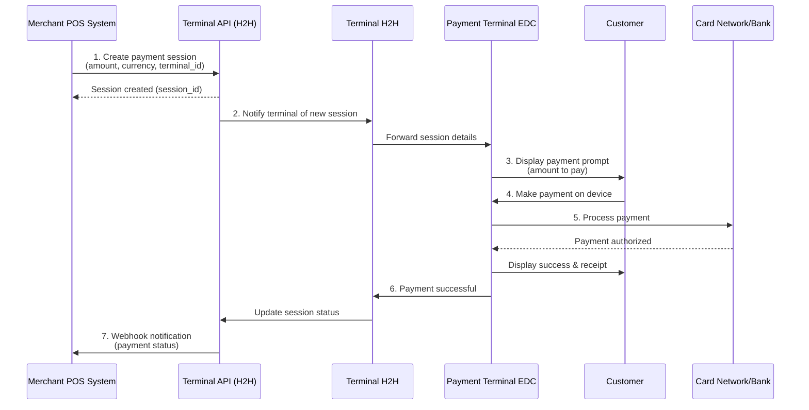

## Overview

<Frame>

</Frame>

Xendit Payment Terminal enables businesses to accept **in-person payments** through our Android-based payment terminals. Whether you're running a café, retail store, restaurant, or kiosk, our terminals let you seamlessly collect payments from **cards, QR, and e-money wallets** — all through one unified platform.

With a **single API integration**, you can connect your existing **Point of Sale (POS), ticketing, or kiosk software** to Xendit's terminals across **multiple countries**, including **Indonesia, Thailand, Vietnam, and Malaysia** (coming soon to the **Philippines**).

## Key Benefits

### 🌍 Multi-Country Reach with a Single Integration

Integrate once with the Xendit Terminal API and deploy in-person payments across Southeast Asia. The same API works in Indonesia, Thailand, Vietnam, and Malaysia — with upcoming support for the Philippines.

### 💳 Universal Payment Acceptance

Accept payments from **Visa, Mastercard, JCB, UnionPay, American Express**, **local debit cards**, and **QR payments**.

### ⚡ Fast Deployment and Go-Live

Our streamlined onboarding and close bank partnerships allow you to receive devices in multiple countries and go live in weeks, not months.

### 🧩 Flexible Integration Options

Connect your POS or software directly to the terminal through our API for self-serve kiosks, automated amount entry, transaction confirmation, and reconciliation.

## Country Availability & Supported Payment Methods

|  | Country | Payment Methods | Payment Channels |
| :----: | :---- | :---- | :---- |
| 🇮🇩 | Indonesia | Credit Cards | Visa, MasterCard, JCB |
|  |  | Debit Cards | GPN |
|  |  | QR Payments | QRIS |
|  |  | E-Money | Brizzi |
| 🇹🇭 | Thailand | Credit Cards | Visa, MasterCard, JCB, UnionPay, American Express (AMEX)  |
|  |  | Debit Cards | Visa, MasterCard |
|  |  | QR Payments | Thai QR PromptPay, TrueMoney Wallet, LINE Pay, ShopeePay, Alipay, Alipay+, WeChat Pay, MaxMe Wallet |
|  |  | Installments | Bangkok Bank, Krungsri (Bank of Ayudhya), SCB (Siam Commercial Bank), Kasikornbank (KBank), Krungthai Bank (KTB), TTB (TMBThanachart Bank), Shopee SPaylater Coming soon: UOB |
| 🇻🇳 | Vietnam | Credit Cards | Visa, MasterCard, American Express (AMEX), JCB, UnionPay |
|  |  | Debit Cards | NAPAS |
|  |  | QR Payments | Viet QR |
| 🇲🇾 | Malaysia | Credit Cards | Visa, MasterCard |
|  |  | Debit Cards | MyDebit, Visa, MasterCard |
|  |  | QR Payments | DuitNow QR (Coming Soon) |
| 🇵🇭 | Philippines | Coming Soon | Coming Soon |

## How It Works

### POS-Integrated Payment Terminal

In this setup, your POS system communicates directly with Xendit Payment Terminal via our API. This enables automated payment workflows where transaction amounts are sent directly from your system to the terminal.

```mermaid
sequenceDiagram
    participant Merchant as Merchant POS System
    participant Xendit as Terminal API (H2H)
    participant Gateway as Terminal H2H
    participant Terminal as Payment Terminal EDC
    participant Customer as Customer
    participant Bank as Card Network/Bank

    Merchant->>Xendit: 1. Create payment session<br/>(amount, currency, terminal_id)
    Xendit-->>Merchant: Session created (session_id)

    Xendit->>Gateway: 2. Notify terminal of new session
    Gateway->>Terminal: Forward session details
    Terminal->>Customer: 3. Display payment prompt<br/>(amount to pay)

    Customer->>Terminal: 4. Make payment on device
    Terminal->>Bank: 5. Process payment
    Bank-->>Terminal: Payment authorized

    Terminal->>Customer: Display success & receipt

    Terminal->>Gateway: 6. Payment successful
    Gateway->>Xendit: Update session status
    Xendit->>Merchant: 7. Webhook notification<br/>(payment status)
```

<Steps>
<Step title="Create payment session">
Your POS system creates a payment session through Terminal API (H2H) with the transaction amount and terminal details.
</Step>

<Step title="Customer completes payment">
The terminal prompts the customer to tap, insert, or swipe their payment card or scan QR code.
</Step>

<Step title="Receive real-time updates">
Your system receives payment status updates through webhooks.
</Step>

<Step title="Complete transaction">
Payment is confirmed, and you can print receipts or update your inventory system.
</Step>
</Steps>

## Settlement

Funds are settled into your **Xendit Balance** within **T+2 days** after the transaction settlement is completed on the device.

You can view all in-person transactions and settlements from your **Xendit Dashboard**, alongside your online payments, for a unified reconciliation experience.

---

## Getting Started

Ready to start accepting in-person payments? Follow these three simple steps:

<Steps>
<Step title="Apply for a Terminal">
Reach out to our team at [inpersonpayments@xendit.co](mailto:inpersonpayments@xendit.co) to request your terminal(s).
</Step>

<Step title="Integrate with Xendit">
Use our [API documentation](/api-reference/terminal-api/introduction) to connect your POS or custom software.

<Info>
**New to Xendit's Payment Terminal?** Start with our [quickstart guide](/guides/getting-started/quickstart) to get your first terminal payment processed in under 10 minutes.
</Info>
</Step>

<Step title="Go Live and Accept Payments">
Once approved, you'll receive your device, complete onboarding, and start accepting in-person payments.
</Step>
</Steps>

<Info>
**Note**: BRI (Indonesia) and NTT (Thailand) terminals require a pre-install of the [Terminal Gateway App](/sdk/gateway/app-configuration) or the matching SDK before use. All other terminal providers support direct connection without pre-install.
</Info>

## Integration Guide

### Prerequisites

Before you begin integration, ensure you have:

- **API credentials** for your chosen integration track from the Xendit In-Person Payment team
- A terminal device with Terminal ID and network connectivity
- Your environment base URL:
  - Development: `https://terminal-dev.xendit.co`
  - Production: `https://terminal.xendit.co`

<Info>
**Credentials vary by track**: The H2H track uses an `API_KEY` (for the Terminal API) and a `CLIENT_KEY` (for the SDK/Gateway App). The C2C track uses a `CLIENT_KEY` for SDK initialization and an `X-API-KEY` for direct API calls. Contact the Xendit In-Person Payment team to obtain the appropriate credentials. See the [Terminal API (H2H) introduction](/api-reference/terminal-api/introduction) or [Terminal API (C2C) introduction](/api-reference/c2c/introduction) for authentication details.
</Info>

<Warning>
Terminal API (H2H) uses HTTP Basic Auth with your API key as the username and an empty password. Always include a trailing colon when constructing the header.
</Warning>

## Payment Terminal Solutions

Choose the integration approach that fits your use case:

<CardGroup cols={3}>
  <Card
    title="Standalone (No Integration)"
    icon="mobile"
    href="/guides/getting-started/standalone-terminal"
  >
    Use the terminal device directly — enter amounts manually on the device. No API or SDK integration needed. Transactions are visible in your Xendit Dashboard.
  </Card>
  <Card
    title="H2H Track"
    icon="server"
    href="/api-reference/terminal-api/introduction"
  >
    **Terminal H2H API** (server-side) manages payment sessions. Connect devices via the **Gateway App** or **H2H SDK** (Android/iOS).
  </Card>
  <Card
    title="C2C Track"
    icon="network-wired"
    href="/api-reference/c2c/introduction"
  >
    **Terminal C2C API** sends commands directly to devices over a local network. Optionally use the **C2C SDK** as a convenience wrapper. BRI/NTT require Gateway App or C2C SDK.
  </Card>
</CardGroup>
