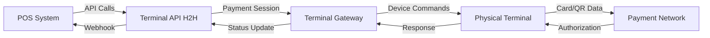

# Terminal Gateway

Terminal Gateway is the companion application that manages physical payment terminal connections for Xendit's In-Person Payment platform. It acts as a bridge between your POS system (via the Terminal API) and physical payment devices, handling device communication, transaction orchestration, and status monitoring.

## What Terminal Gateway does

Terminal Gateway provides essential infrastructure for terminal payment processing:

- **Device Management**: Connect and manage multiple physical payment terminals from various providers (BRI, NTT (previously GHL), Cashup, SHC)
- **Transaction Orchestration**: Route payment sessions from the Terminal API to the appropriate terminal device
- **Real-time Monitoring**: Track terminal status, connectivity, and transaction progress
- **Connection Modes**: Support both host-to-host (cloud-based) and client-to-client (local network) integration patterns
- **Multi-device Support**: Orchestrate concurrent payment sessions across different terminals

<Info>
Terminal Gateway works alongside the Terminal API (H2H) to provide complete in-person payment functionality. The Terminal API creates payment sessions while Terminal Gateway manages the physical terminal connections and executes the transactions.
</Info>

## Integration architecture

## Platform availability

Terminal Gateway is available as:

<CardGroup cols={1}>
<Card title="Desktop Application" icon="desktop" href="/sdk/gateway/app-configuration">
  Standalone app for Windows and macOS to manage terminal devices locally
</Card>
</CardGroup>

## Connection modes

Terminal Gateway supports two integration patterns:

### Host-to-Host (Recommended)

Your POS system connects to Xendit's Terminal API in the cloud, which routes payment sessions to Terminal Gateway running on your device. This centralizes management and scaling.

**Use when:**
- Managing multiple locations or devices
- Need centralized monitoring and reporting
- Want simplified network configuration

### Client-to-Client

Your POS system connects directly to Terminal Gateway over the local network using the RESTful API. Gateway handles all terminal communication independently.

**Use when:**
- Running fully local POS systems
- Need offline-capable terminals (internet still required for payment processing)
- Bundling POS and terminals for retail distribution

<Warning>
Client-to-client mode requires managing local network configuration, firewall rules, and direct IP/port access. See the [Terminal API (C2C) documentation](/api-reference/c2c/introduction) for detailed setup requirements.
</Warning>

## Getting started

<Steps>
<Step title="Install Terminal Gateway">
  Download and install the Terminal Gateway application on your device
</Step>

<Step title="Configure connection">
  Set up your client key, choose connection mode (host-to-host or client-to-client), and configure terminal providers
</Step>

<Step title="Connect terminals">
  Pair your physical payment terminals with Terminal Gateway following provider-specific instructions
</Step>

<Step title="Start processing">
  Create payment sessions through the Terminal API and monitor transactions through Terminal Gateway
</Step>
</Steps>

## Next steps

<CardGroup cols={2}>
<Card title="App Configuration" icon="gear" href="/sdk/gateway/app-configuration">
  Configure Terminal Gateway settings, connection types, and device management
</Card>

<Card title="Terminal API (H2H)" icon="code" href="/api-reference/terminal-api/introduction">
  Learn how to create payment sessions and manage transactions via API
</Card>

<Card title="Terminal API (C2C)" icon="network-wired" href="/api-reference/c2c/introduction">
  Explore client-to-client mode for local network integration
</Card>
</CardGroup>
